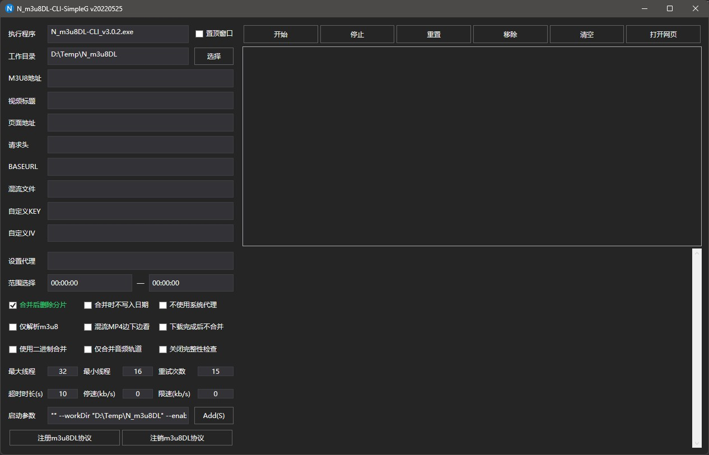

# N_m3u8DL-CLI-SimpleG-List (Windows Only)
根据m3u8下载工具 [N_m3u8DL-CLI](https://github.com/nilaoda/N_m3u8DL-CLI) 命令行工具的官方 Simple GUI 图形界面启动器改动。  
[https://github.com/nilaoda/N_m3u8DL-CLI-SimpleG](https://github.com/nilaoda/N_m3u8DL-CLI-SimpleG)  

# 新功能
* 新增任务列表功能
* 自动保存和读取列表到文件，软件关掉，下次打开列表还在
* 列表区域下方会显示下载进度的Log。
* 原版的"Go"按钮，变为"Add"，改为把任务添加到列表，而不是直接下载。
* GUI端支持 m3u8dl 协议。可以配合chrome浏览器扩展 [猫抓](https://chromewebstore.google.com/detail/%E7%8C%AB%E6%8A%93/jfedfbgedapdagkghmgibemcoggfppbb?hl=zh-CN) 使用。在[猫抓](https://chromewebstore.google.com/detail/%E7%8C%AB%E6%8A%93/jfedfbgedapdagkghmgibemcoggfppbb?hl=zh-CN)中，点击下载，可以自动打开本GUI工具，把下载任务添加到列表中。
* 参数中，增加"--pageUrl"参数。这个参数是指下载的网页。实际下载时，不会用到，但是会保存在任务中。这样，选择一个任务，点击"打开网页"按钮，就能方便的打开该视频的网页。当下载失败时，便于重新获取m3u8地址。
* 点击任务列表中的一个任务，任务的内容，会填充到左边表单，可以修改之后，重新添加。
* 任务列表中的任务，右侧会显示简单的下载状态。   
* 同时只下载1个任务。

  

# 使用方法
## 下载N_m3u8DL-CLI
(这一步，会用N_m3u8DL-CLI直接跳过)  
在[N_m3u8DL-CLI项目页面](https://github.com/nilaoda/N_m3u8DL-CLI)项目页面，点击右侧Release页面，去下载最新版本。  

要下载的版本是：`N_m3u8DL-CLI_v版本号_with_ffmpeg_and_SimpleG.zip`。  

**下载后解压到自定义的位置，以后位置不要再换。**

## 对于已经有N_m3u8DL-CLI的用户
如果注册过它的m3u8DL协议，要先注销这个协议。因为要改为在本增强版GUI工具那边注册这个协议。

注销方法：命令行模式，前往N_m3u8DL-CLI目录。执行：
> N_m3u8DL-CLI可执行文件名 --unregisterUrlProtocol  

## 下载本增强版GUI
前往项目池右侧Release页面，下载最新版。  
解压.exe文件到N_m3u8DL-CLI同目录。

## 配置本增强版GUI
**先用管理员模式打开本增强版GUI。** 点击左下角的"注册m3u8DL协议"。注册成功后，关闭。 **以后使用无须管理员模式。** 只有要注销协议，才用管理员模式打开。  

用普通模式打开本增强版GUI工具，在左侧表单：  
* 填写N_m3u8DL-CLI可执行文件名
* 选择要下载到的目录
* 勾选"合并后删除分片"  

配置完成。


## 手动添加任务到列表（不推荐）
有了m3u8地址，可以手动填写左侧的表单，然后点击最下面"Add"按钮，把任务添加到右侧列表。  

添加了足够的任务，下载即可。   

支持一边下载，一边添加新任务。  

## 配合浏览器扩展"猫抓"一键新建任务到列表（推荐）
猫抓 是个视频嗅探 浏览器扩展。可以嗅探m3u8，而且支持刚才注册的那个N_m3u8DL-CLI自定义协议。

* 安装猫抓浏览器扩展
[https://chromewebstore.google.com/detail/%E7%8C%AB%E6%8A%93/jfedfbgedapdagkghmgibemcoggfppbb?hl=zh-CN](https://chromewebstore.google.com/detail/%E7%8C%AB%E6%8A%93/jfedfbgedapdagkghmgibemcoggfppbb?hl=zh-CN)  
* 在猫抓的设置中，开启`调用N_m3u8DL-CLI的m3u8dl://协议下载m3u8 和 mpd`。填写好协议要用的下载参数。

下面的参数供参考：
```
"${url}" --saveName "${title}" --workDir "你的下载目录" --enableDelAfterDone --headers "Referer:${initiator}" --pageUrl "${webUrl}" --proxyAddress "socks5://127.0.0.1:你的代理端口"
```

好了，配置完毕。

## 在视频网页上使用
以后在有m3u8的网页上，点击猫抓扩展图标，点击m3u8旁边的下载按钮。就会触发之前注册的协议，自动打开本增强版GUI工具，把这个地址，自动添加到任务列表中。  

添加够了之后，点击下载即可。  


# 下载规则
## 同时进行任务数
同时只下载一个任务，完成一个再下一个。

## 列表保存
任务列表不保存，关闭GUI既清空。  
m3u8地址经常一两个小时就会失效，所以就懒得做保存列表功能了，凑合吧。

## 任务状态
下载列表右侧有个任务状态显示。默认为空，其他几个状态是："Downloading, Stopped, Failed, Done"等。

## 跳过的任务
凡是状态不为空的任务，都会直接跳过。所以，停止的任务，再次下载前要重置状态：  

选择状态不为空的任务，点击按钮"重置"。 **只会重置状态，不会删除已经下载的分片。**  

## 同名任务
添加新任务时，如果存在同名的任务 ：
* 如果存在的任务状态是空，就会去更新这个任务的地址。
* 如果存在的任务状态不是空，就会新增一个同名的任务。

## 选择任务
任务列表中，点击选择一个任务，任务内容，会被填充到左侧的表单。可以修改后再次添加。

## 新参数：页面地址
猫抓里，对应的命令参数是`pageUrl`。这个参数，下载时并不使用，但是会保存在任务中。

这样，点击一个任务，再点击按钮`打开网页`就会在浏览器打开这个视频地址。方便获取新的m3u8。

## 某些情况界面卡住
下载期间，右下方会显示下载过程的Log信息。当下载速度太慢 或 文件合并的时候，会没有新的Log，而UI要一直等待Log，界面就会短暂卡住。这是人家的简易项目架构，这里只是改动，所以就凑合吧。  


# 开发人员信息
如果要自己继续开发，以下信息需要了解。

原版是C#的WPF项目。框架最高到.net framework 4.8，难以移植到更高。

虽然看起来只是添加了个任务列表，但背后的辛苦非常之多。

首先，windows的注册自定义协议，有很大的局限。当浏览器中，触发了协议时，windows只能打开指定程序，并传递参数。

但是，如果这个程序已经打开了，那么是收不到任何参数的。windows会再打开一个新实例。

所以，这里只能是在新实例里面，查找是否有同名的进程已经打开，然后，把参数，传递给已经打开的进程，并把这个进程，显示到前台。之后，这个新实例，再把自己关闭。

两个进程之间通讯，使用的是命名管道。程序一旦运行，就有个反复监听命名管道的服务。

监听命名管道是手写的异步管道，才能不卡界面。异步管道，以任务的方式，跑在不同线程中。这样，才能不卡住界面。

然而，在WPF中，不同的线程，不能修改UI。所以，获得了数据之后，不能简单添加到UI列表中。必须使用Invoke和Action的方式修改UI。

最后，下载的时候，是在后台运行N_m3u8DL-CLI进程进行下载。要不卡住界面，这个进程就要异步。异步等待进程结束的方法，是.net 6.0才有的。在.net framework 4.8上，还没有提供。所以，这里是手写了一个异步等待进程结束的方法。

同样的，N_m3u8DL-CLI进程的命令行输出的Log，要用异步的方式，重定向到本工具界面上。然而，即使异步，也要等待N_m3u8DL-CLI提供Log信息。如前所述，N_m3u8DL-CLI进程不提供的时候，就会卡住界面。

# 后续
没有。

本来以为几个小时就能搞定的简单功能，没想到一大堆雷区，折磨了好几天，已经严重超时。不打算更新，用的人将就。开发人员可以自行继续开发。


# 原版文档

对应命令行工具：https://github.com/nilaoda/N_m3u8DL-CLI

相关说明：https://nilaoda.github.io/N_m3u8DL-CLI/SimpleGUI.html


# 更新Log
* v1.1 添加保存下载列表功能
* v1.1.1 改善log太多导致界面卡顿。每100条log清理一次。